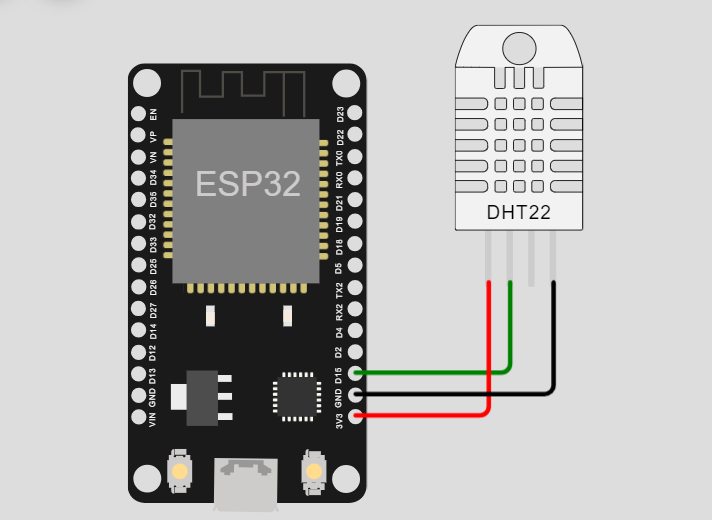
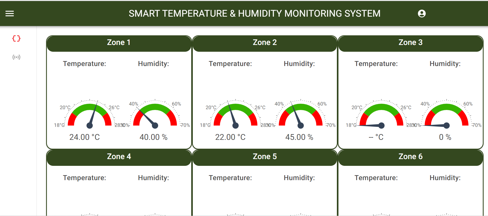

#  IoT-Based Temperature Humidity Monitoring System

It is a sensor-based system that uses LoRaWAN technology to monitor temperature and humidity in various environments. This system is suitable for applications in various industries, including food storage, pharmaceuticals, and environmental monitoring.

The system consists of ESP32 & DHT22 that are placed at different locations to monitor temperature and humidity levels. The DHT22 sensors transmit data to a ESP32 that collects and forwards the data to a cloud-based platform. The platform stores and processes the data, allowing users to monitor the temperature and humidity levels in real-time and receive alerts if the levels go beyond the specified limits.

● <b>Tech Stack:</b> 
Python, Node.Js, MongoDB, Linux(Ubuntu), React & Next.JS.

## Hardware

## Dashboard

## Devices Page

## Device Page

## Author - Chirag Kataria

- [Linkedin](https://www.linkedin.com/in/chirag-kataria-59b37b261/)
- [Github](https://github.com/chiragkataria0510)

